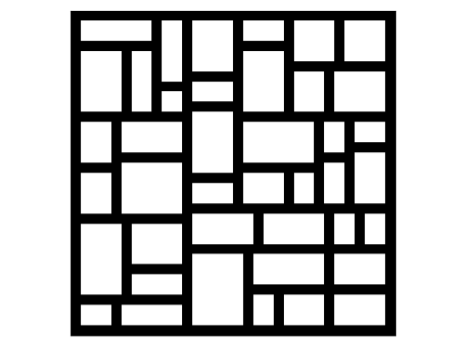
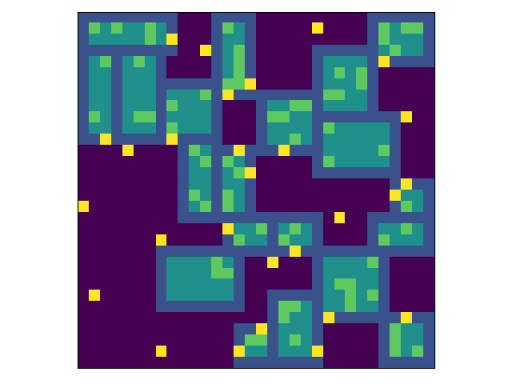
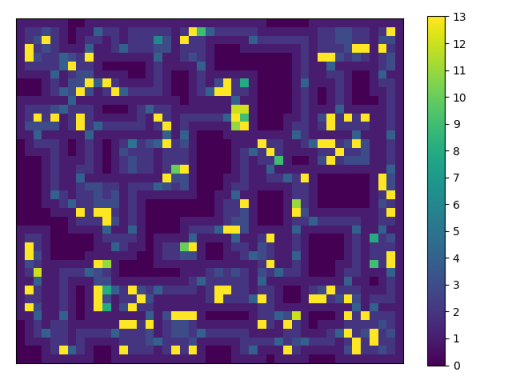
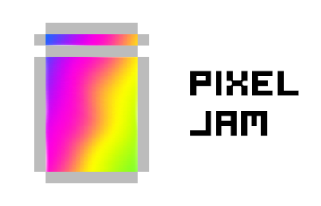

# Stranded
**TIMATHON CODE JAM SUBMISSION FROM PIXEL JAM TEAM**

**Pls read until the end :)**

## As the story goes...

Ty had just woken up in a strange place... He was alone -actually not- and he had his wooden sword to defend himself.
He had to get out of this place, this **dungeon**, so he had to explore all around it and find the way out of it...
or at least the way to a higher level.

Help Ty find his way around the dungeon, collect ingredients, craft items and fight enemies in this infinite game where
every level is procedurally generated! How far can you go?

## How to play
- Use WASD to move
- Walk into items or doors to interact with them
- Click to attack
- Find the way to the next level!

## Timathon topic: Generate

In this game, every single level you play (and even the one that appears in the start menu) and the enemy and item
distribution is made by an original generation algorithm we are very proud of: We call it the **Cell Split Algo**.
It's written in Python and you can see it's source code in the *Level-gen* folder in this repo, although what the game
actually uses is a compiled executable from this source code found in *Unity/Assets/StreamingAssets/level-gen.exe*

## How does the generator work?

***Please note that the source code doesn't follow the instructions in this exact order, we have optimized it for 
maximum performance and so the process is a bit different***

- It all starts by making an empty matrix and creating a giant `room` object that covers it all.
- Then, a recursive function makes this room divide into two, and then makes those two rooms split into two, and so on
until all of the rooms reach a certain size limit. You can also see here why we call the algorithm the *Cell Split Algo*.
We are left with a skeleton for the level pretty much like this:

- Then goes the 'Room Selection' stage, where we decide which rooms will become halls or normal rooms.
- Now we initialize the rooms, and the initialization process for every room is different. For example, the normal rooms
generate their walls and floor (note in the image below that they also generate grass) and halls have their 'find mode'
turned on which helps other rooms know they are there in further steps.
- We generate doors. Each room, be it a normal room or a hall, generates doors around them by looking around them if
there is a valid room to connect to and choose a good place to place a door. In this step the 'find mode' of halls is
also turned off as it's no longer necessary. We end up with a map looking like this: (Yellow squares are doors and also
note that the skeleton is invisible now)

- *From here on we don't have illustrations because the generator does all of this at the same time*
- Based on the position of the doors, we generate the hallways now. This was a hard part for us because it was literally
teaching a computer to connect dots, but with some help we did it.
- Now comes a second room selection part. Each Room and hall branches off into a variation of itself. These variations
include start, end, and chest rooms for the normal rooms and void halls for the halls. This will affect the way in which
they generate all of their inner loot and mobs.
- Now we have to distribute the items throughout the whole level. The amount of items that will spawn in each level is
defined by the mean of the level's dimensions plus a slight random bias to spawn more or less.
- To end, we call a fill() method on every single room, and they fill themselves according to the type and items
assigned to them. In this step, every room also generates the mobs it will have inside based on the area of each room.
The finished map looks pretty much like this: (Each different color represents a different type of block/item placed)

- To wrap it all up, the generator converts all of this into JSON format and passes it into the game and the game
interprets it.

***You can replicate the last image we show here by running the level-gen.py script from command line with the arguments
`30 30 1`, for example: `python level-gen.py 30 30 1`.***

## Thanks for reading! Enjoy the game and give us a vote!
Made with love by the Pixel Jam team <3

